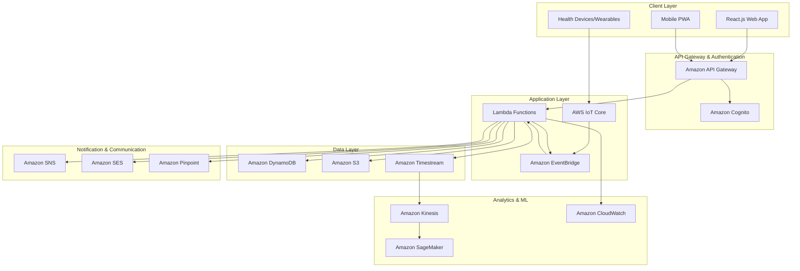

# Design Document: Healthcare Monitoring App

## Overview

The Healthcare Monitoring App is a cloud-native React.js application built on AWS infrastructure, designed to provide comprehensive health monitoring for elderly users while keeping their families informed and connected. The system emphasizes accessibility, reliability, and security while maintaining HIPAA compliance throughout all operations.

The architecture follows a serverless, event-driven design pattern that ensures scalability, cost-effectiveness, and high availability. The application serves two distinct user types: Primary Users (elderly individuals) and Secondary Users (family members/caregivers), each with tailored interfaces and functionality.

Key design principles include:
- **Accessibility-first**: Large fonts, high contrast, voice input, and simplified navigation
- **Security by design**: End-to-end encryption, HIPAA compliance, and comprehensive audit logging
- **Real-time responsiveness**: Immediate alerts and notifications for health emergencies
- **Scalable architecture**: Serverless AWS services that automatically scale with demand
- **Device integration**: Seamless connectivity with health monitoring devices and wearables

## Architecture

### High-Level Architecture



### AWS Services Selection

**Frontend & API Layer:**
- **Amazon CloudFront**: Global CDN for fast content delivery
- **Amazon API Gateway**: RESTful API management with throttling and monitoring
- **Amazon Cognito**: User authentication and authorization with MFA support

**Compute & Processing:**
- **AWS Lambda**: Serverless functions for business logic and event processing
- **Amazon EventBridge**: Event-driven architecture for decoupled services

**Data Storage:**
- **Amazon DynamoDB**: NoSQL database for user profiles, care circles, and app data
- **Amazon Timestream**: Time-series database optimized for health metrics and device data
- **Amazon S3**: Secure storage for health reports, documents, and static assets

**IoT & Device Integration:**
- **AWS IoT Core**: Secure device connectivity and message routing
- **AWS IoT Device Management**: Device provisioning and lifecycle management

**Notifications & Communication:**
- **Amazon SNS**: Push notifications and SMS alerts
- **Amazon SES**: Email notifications and reports
- **Amazon Pinpoint**: Multi-channel messaging and user engagement

**Analytics & Monitoring:**
- **Amazon Kinesis**: Real-time data streaming and processing
- **Amazon SageMaker**: Machine learning for health pattern analysis
- **Amazon CloudWatch**: Application monitoring and alerting

**Security & Compliance:**
- **AWS KMS**: Encryption key management
- **AWS CloudTrail**: Audit logging and compliance monitoring
- **AWS Config**: Configuration compliance monitoring

## Components and Interfaces

### Frontend Components

#### Primary User Interface (Elderly Users)
```typescript
interface PrimaryUserDashboard {
  healthMetrics: HealthMetricsWidget;
  medicationReminders: MedicationWidget;
  emergencyButton: EmergencyAlertWidget;
  appointmentSchedule: AppointmentWidget;
  familyMessages: MessageWidget;
  voiceAssistant: VoiceInputWidget;
}

interface AccessibilityFeatures {
  fontSize: 'large' | 'extra-large' | 'maximum';
  contrast: 'high' | 'maximum';
  voiceNavigation: boolean;
  screenReader: boolean;
  largeButtons: boolean;
  simplifiedLayout: boolean;
}
```

#### Secondary User Interface (Family/Caregivers)
```typescript
interface SecondaryUserDashboard {
  healthOverview: HealthSummaryWidget;
  alertsPanel: AlertManagementWidget;
  communicationHub: FamilyMessagingWidget;
  reportsViewer: HealthReportsWidget;
  settingsPanel: CareCircleSettingsWidget;
}

interface MonitoringControls {
  alertPreferences: AlertConfiguration;
  dataVisibility: PrivacySettings;
  emergencyContacts: ContactManagement;
  reportSchedule: ReportConfiguration;
}
```

### Backend Service Interfaces

#### Health Monitoring Service
```typescript
interface HealthMonitoringService {
  recordVitalSigns(userId: string, vitals: VitalSigns): Promise<void>;
  analyzeHealthTrends(userId: string, timeRange: TimeRange): Promise<HealthAnalysis>;
  detectAnomalies(userId: string, vitals: VitalSigns): Promise<AnomalyResult>;
  generateHealthReport(userId: string, reportType: ReportType): Promise<HealthReport>;
}

interface VitalSigns {
  heartRate?: number;
  bloodPressure?: BloodPressure;
  temperature?: number;
  oxygenSaturation?: number;
  weight?: number;
  timestamp: Date;
  source: 'manual' | 'device' | 'wearable';
}
```

#### Alert Management Service
```typescript
interface AlertService {
  createAlert(alert: HealthAlert): Promise<string>;
  processEmergencyEvent(event: EmergencyEvent): Promise<void>;
  notifyCareCircle(userId: string, alert: HealthAlert): Promise<NotificationResult>;
  escalateAlert(alertId: string, escalationLevel: EscalationLevel): Promise<void>;
}

interface HealthAlert {
  id: string;
  userId: string;
  type: AlertType;
  severity: 'low' | 'medium' | 'high' | 'critical';
  message: string;
  timestamp: Date;
  acknowledged: boolean;
  escalated: boolean;
}
```

#### Device Integration Service
```typescript
interface DeviceIntegrationService {
  registerDevice(userId: string, device: HealthDevice): Promise<string>;
  processDeviceData(deviceId: string, data: DeviceData): Promise<void>;
  validateDeviceData(data: DeviceData): Promise<ValidationResult>;
  syncDeviceSettings(deviceId: string, settings: DeviceSettings): Promise<void>;
}

interface HealthDevice {
  id: string;
  type: DeviceType;
  manufacturer: string;
  model: string;
  capabilities: DeviceCapability[];
  connectionType: 'bluetooth' | 'wifi' | 'cellular';
}
```

### API Endpoints

#### Health Data API
```typescript
// POST /api/v1/health/vitals
interface RecordVitalsRequest {
  vitals: VitalSigns;
  deviceId?: string;
}

// GET /api/v1/health/trends/{userId}
interface HealthTrendsResponse {
  trends: HealthTrend[];
  analysis: TrendAnalysis;
  recommendations: string[];
}

// POST /api/v1/health/emergency
interface EmergencyAlertRequest {
  location?: GeoLocation;
  symptoms?: string[];
  severity: EmergencySeverity;
}
```

#### Care Circle API
```typescript
// GET /api/v1/care-circle/{userId}
interface CareCircleResponse {
  members: CareCircleMember[];
  permissions: PermissionMatrix;
  communicationPreferences: CommunicationSettings;
}

// POST /api/v1/care-circle/invite
interface InviteMemberRequest {
  email: string;
  relationship: RelationshipType;
  permissions: Permission[];
}
```

## Data Models

### User Management
```typescript
interface PrimaryUser {
  id: string;
  profile: UserProfile;
  healthProfile: HealthProfile;
  careCircle: string[]; // Secondary user IDs
  preferences: UserPreferences;
  devices: string[]; // Device IDs
  createdAt: Date;
  lastActive: Date;
}

interface SecondaryUser {
  id: string;
  profile: UserProfile;
  primaryUsers: string[]; // Primary user IDs they monitor
  alertPreferences: AlertPreferences;
  permissions: PermissionSet;
  createdAt: Date;
}

interface HealthProfile {
  conditions: MedicalCondition[];
  medications: Medication[];
  allergies: string[];
  emergencyContacts: EmergencyContact[];
  healthcareProviders: HealthcareProvider[];
  baselineVitals: BaselineVitals;
}
```

### Health Data Models
```typescript
interface HealthRecord {
  id: string;
  userId: string;
  timestamp: Date;
  type: 'vitals' | 'medication' | 'symptom' | 'appointment';
  data: HealthData;
  source: DataSource;
  verified: boolean;
}

interface MedicationRecord {
  id: string;
  userId: string;
  medication: Medication;
  scheduledTime: Date;
  takenTime?: Date;
  status: 'scheduled' | 'taken' | 'missed' | 'skipped';
  adherenceScore: number;
}

interface AppointmentRecord {
  id: string;
  userId: string;
  provider: HealthcareProvider;
  type: AppointmentType;
  scheduledTime: Date;
  status: 'scheduled' | 'confirmed' | 'completed' | 'cancelled' | 'missed';
  reminders: ReminderSettings;
}
```

### Device and IoT Models
```typescript
interface DeviceReading {
  deviceId: string;
  userId: string;
  timestamp: Date;
  readings: SensorReading[];
  batteryLevel?: number;
  signalStrength?: number;
  location?: GeoLocation;
}

interface SensorReading {
  type: SensorType;
  value: number;
  unit: string;
  accuracy: number;
  calibrationDate?: Date;
}
```

## Correctness Properties

*A property is a characteristic or behavior that should hold true across all valid executions of a system—essentially, a formal statement about what the system should do. Properties serve as the bridge between human-readable specifications and machine-verifiable correctness guarantees.*

Based on the prework analysis, the following properties validate the system's correctness:

### Health Data Management Properties

**Property 1: Health data persistence with validation**
*For any* valid health data entry (vital signs, medications, appointments), the system should store the data with accurate timestamps and validate all values against acceptable ranges before storage.
**Validates: Requirements 1.1, 1.4, 2.4, 6.5**

**Property 2: Device data integration and processing**
*For any* health device data received, the system should automatically import, categorize, validate, and prioritize device data over manual entries while flagging any discrepancies.
**Validates: Requirements 1.2, 7.1, 7.2, 7.3, 7.4**

**Property 3: Health trend analysis and visualization**
*For any* user's health data over time, the system should generate accurate trends, patterns, and simple visualizations that highlight improvements and areas of concern.
**Validates: Requirements 1.5, 10.1, 10.2, 10.5**

### Alert and Notification Properties

**Property 4: Emergency alert generation and escalation**
*For any* emergency event (abnormal vitals, missed check-ins, manual alerts, fall detection), the system should immediately generate appropriate alerts and escalate according to severity and time-based rules.
**Validates: Requirements 1.3, 3.1, 3.2, 3.3, 3.4**

**Property 5: Medication adherence monitoring**
*For any* medication schedule and adherence data, the system should track compliance, send timely reminders, and generate alerts when adherence falls below thresholds or doses are missed.
**Validates: Requirements 2.1, 2.2, 2.3, 2.5**

**Property 6: Multi-channel notification delivery**
*For any* alert generated, the system should deliver notifications within 30 seconds via multiple channels (push, SMS, email), provide delivery confirmation, retry failed deliveries up to 3 times, and respect user preferences.
**Validates: Requirements 9.1, 9.2, 9.4**

**Property 7: Alert prioritization and acknowledgment**
*For any* set of simultaneous alerts, the system should prioritize by severity, consolidate related notifications, and notify all care circle members when alerts are acknowledged.
**Validates: Requirements 9.3, 9.5**

### Care Circle and Communication Properties

**Property 8: Care circle data access and sharing**
*For any* care circle member accessing health data, the system should display current health status, provide appropriate data visibility based on permissions, and log all access events with timestamps.
**Validates: Requirements 4.1, 4.5, 8.4, 8.5**

**Property 9: Family communication and reporting**
*For any* communication between users, the system should deliver messages with read receipts, provide weekly health summaries to care circle members, and share appointment schedules automatically.
**Validates: Requirements 4.3, 4.4, 6.2**

### Accessibility and User Interface Properties

**Property 10: Elderly-friendly interface compliance**
*For any* UI element displayed, the system should use minimum 18pt fonts, high contrast colors, limit navigation to maximum 6 items, provide voice guidance, and support both touch and voice input.
**Validates: Requirements 5.1, 5.2, 5.3, 5.5**

**Property 11: Error handling and user guidance**
*For any* error condition, the system should display clear, non-technical error messages with suggested actions that are appropriate for elderly users.
**Validates: Requirements 5.4**

### Appointment and Healthcare Integration Properties

**Property 12: Appointment management and reminders**
*For any* scheduled appointment, the system should send reminders at 24 hours and 2 hours before, integrate with calendar applications, detect missed appointments, and notify care circle members appropriately.
**Validates: Requirements 6.1, 6.3, 6.4**

### Security and Privacy Properties

**Property 13: Data encryption and authentication**
*For any* health data stored or transmitted, the system should use AES-256 encryption and require multi-factor authentication for all user access attempts.
**Validates: Requirements 8.1, 8.2**

**Property 14: Device connectivity and fallback**
*For any* health device connection, the system should maintain 15-minute data import intervals, detect disconnections, notify users of connectivity issues, and provide manual entry alternatives.
**Validates: Requirements 7.5**

### Reporting and Analytics Properties

**Property 15: Health report generation and export**
*For any* user's health data, the system should generate comprehensive reports (weekly, monthly, quarterly), identify concerning trends with healthcare provider recommendations, and export reports in PDF format.
**Validates: Requirements 10.3, 10.4**

**Property 16: Emergency information provision**
*For any* emergency service contact, the system should provide complete medical history, current medications, and relevant health status information.
**Validates: Requirements 3.5**

<function_calls>
<invoke name="prework">
<parameter name="featureName">healthcare-monitoring-app

## Error Handling

### Error Categories and Responses

**Data Validation Errors:**
- Invalid vital signs ranges → Clear message with acceptable ranges
- Missing required fields → Highlight missing fields with voice guidance
- Device connectivity issues → Automatic retry with manual entry fallback

**Authentication and Authorization Errors:**
- Failed login attempts → Progressive security measures with family notification
- Insufficient permissions → Clear explanation of access restrictions
- Session timeout → Gentle re-authentication with context preservation

**System and Network Errors:**
- API failures → Graceful degradation with offline mode capabilities
- Database connectivity → Local caching with sync when restored
- Third-party service outages → Alternative communication channels

**Emergency Handling:**
- Critical health alerts → Multiple redundant notification channels
- Device failures during emergencies → Immediate manual alert options
- Network outages → SMS fallback and local emergency contacts

### Error Recovery Strategies

**Graceful Degradation:**
- Offline mode for essential functions (medication reminders, emergency alerts)
- Local data storage with automatic sync when connectivity restored
- Progressive web app capabilities for continued access

**User-Friendly Error Messages:**
- Large, high-contrast error displays
- Simple language avoiding technical jargon
- Clear action steps with voice guidance
- Visual icons to support text messages

**Automatic Recovery:**
- Background retry mechanisms for failed operations
- Data consistency checks and automatic correction
- Health device reconnection attempts
- Notification delivery retry logic

## Testing Strategy

### Dual Testing Approach

The healthcare monitoring app requires comprehensive testing using both unit tests and property-based tests to ensure reliability and correctness for elderly users and their families.

**Unit Testing Focus:**
- Specific user scenarios and edge cases
- Integration points between AWS services
- Error conditions and recovery mechanisms
- Accessibility feature validation
- HIPAA compliance verification

**Property-Based Testing Focus:**
- Universal health data processing behaviors
- Alert generation and notification delivery
- Device integration and data validation
- User interface accessibility requirements
- Security and privacy controls

### Property-Based Testing Configuration

**Testing Framework:** Jest with fast-check for JavaScript/TypeScript property-based testing
**Test Configuration:**
- Minimum 100 iterations per property test
- Custom generators for health data, user profiles, and device readings
- Shrinking enabled for minimal failing examples
- Timeout configuration for real-time notification tests

**Property Test Implementation:**
Each correctness property will be implemented as a property-based test with the following tag format:
**Feature: healthcare-monitoring-app, Property {number}: {property_text}**

**Example Property Test Structure:**
```typescript
describe('Healthcare Monitoring App Properties', () => {
  test('Property 1: Health data persistence with validation', () => {
    fc.assert(fc.property(
      healthDataGenerator(),
      (healthData) => {
        // Test that any valid health data is stored with timestamp and validation
        const result = healthMonitor.storeHealthData(healthData);
        expect(result.timestamp).toBeDefined();
        expect(result.validated).toBe(true);
        expect(result.stored).toBe(true);
      }
    ), { numRuns: 100 });
  });
});
```

### Integration Testing

**AWS Service Integration:**
- API Gateway endpoint testing with authentication
- Lambda function integration with DynamoDB and Timestream
- IoT Core device message processing
- SNS/SES notification delivery verification

**Third-Party Integration:**
- Health device SDK integration testing
- Calendar application sync verification
- Emergency service API integration

### Accessibility Testing

**Automated Accessibility Testing:**
- WCAG 2.1 AA compliance verification
- Screen reader compatibility testing
- Keyboard navigation validation
- Color contrast ratio verification

**Manual Accessibility Testing:**
- Elderly user simulation testing
- Voice input functionality verification
- Large font and high contrast validation
- Simplified navigation flow testing

### Security and Compliance Testing

**HIPAA Compliance Testing:**
- Data encryption verification (at rest and in transit)
- Access control and audit logging validation
- Data retention and deletion compliance
- Business Associate Agreement requirement verification

**Security Testing:**
- Multi-factor authentication testing
- API security and rate limiting
- Data privacy control validation
- Penetration testing for healthcare data protection

### Performance and Reliability Testing

**Real-Time Performance:**
- Alert delivery time verification (30-second requirement)
- Device data processing latency testing
- Notification channel reliability testing

**Scalability Testing:**
- Concurrent user load testing
- Health data volume processing
- AWS service auto-scaling verification

**Disaster Recovery Testing:**
- Data backup and recovery procedures
- Service failover and redundancy
- Emergency communication channel testing